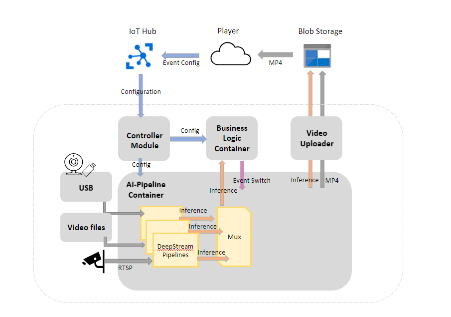

**NOTE**
Please note that while the code in this repository is licensed under MIT, it makes use of third party software that may be under
different licenses. Especially note that the ai-pipeline container is derived from NVIDIA's DeepStream containers. Your use of NVIDIA
DeepStream and/or related deliverables is currently subject to the terms and limitations stated in this [license](https://developer.nvidia.com/deepstream-eula).

**ATTENTION**
No part of this code should be considered stable or is intended to be used only for test purposes. This code base is not designed for production use cases. It is provided as an example of how you might integrate Azure IoT Edge with NVIDIA DeepStream.

# Table of Contents

* [Prerequisite checklist for Azure DeepStream Accelerator](./documentation/quickstart-readme.md) - Install all the dependencies and get yourself up and running.
* [Tutorial: Azure DeepStream Accelerator - Getting started path](./documentation/tutorial-getstarted-path.md) - Deploy an example use case.
* [Tutorial: Azure DeepStream Accelerator - Pre-built model path](./documentation/tutorial-prebuiltmodel-path.md) - Learn how to deploy a solution with a presupported model from a model zoo.
* [Tutorial: Azure DeepStream Accelerator - Bring your own model path (BYOM) model path](./documentation/tutorial-byom-path.md) - Learn how to bring a custom model.
* [Troubleshoot: Azure DeepStream Accelerator - Known issues](./documentation/troubleshooting.md) - If you encounter issues when you are creating an Edge AI solution using Azure DeepStream Accelerator.
* [How to use the command line interface tool in Azure DeepStream Accelerator](./documentation/how-to-usecommandlinetool.md) - Learn about the CLI Tool.
* [How to update the business logic in Azure DeepStream Accelerator](./documentation/how-to-modifybusinesslogic.md) - Learn about how to bring your own business logic to the pipeline.
* [How to use the Azure DeepStream Accelerator Player web app](./documentation/how-to-usewebappwidget.md) - Learn about the Player (video playing widget).
* [How to configure the Controller module](./documentation/how-to-configcontroller.md) - Learn about the various configuration options for Azure DeepStream Accelerator.
* [How to migrate from a DeepStream only computer vision solution to DeepStream with Azure DeepStream Accelerator](./documentation/how-to-migratefromdeepstream.md) - Learn how to migrate from a pure DeepStream solution to Azure DeepStream Accelerator.
* [How to dewarp video streams for your Azure DeepStream Accelerator solution](./documentation/how-to-dewarpvideo.md) - Learn how to dewarp fisheye cameras.
* [How to add multiple video streams to your Azure DeepStream Accelerator solution](./documentation/how-to-addmultiplevideos.md) - Learn how to run a solution involving multiple camera sources or multiple AI configurations.
* [How to include Azure Monitor to improve observability](./documentation/how-to-includeazuremontior.md) - Learn how to integrate with Azure Monitor.

# Azure DeepStream Accelerator overview

Azure DeepStream Accelerator includes developer tools that provide a custom developer experience. It enables you to create NVIDIA DeepStream containers using Microsoft-based images and guidance, supported models from NVIDIA out of the box, and/or bring your own models.

DeepStream is NVIDIA’s toolkit to develop and deploy Vision AI applications and services. It provides multi-platform, scalable, Transport Layer Security (TLS)-encrypted security that can be deployed on-premises, on the edge, and in the cloud.

## Azure DeepStream Accelerator offers:

- **Simplifying your development process**

  Auto selection of AI model execution and inference provider: One of several execution providers, such as ORT, CUDA, and TENSORT, are automatically selected to simplify your development process.

- **Customizing Region of Interest (ROI) to enable your business scenario**

  Region of Interest (ROI) configuration widget: Azure DeepStream Accelerator Player, a web app widget, is included for customizing ROIs to enable event detection for your business scenario.

- **Simplifying the configuration for pre/post processing**

  You can add a Python-based model parser using a configuration file, instead of hardcoding it into the pipeline.

- **Offering a broad Pre-built AI model framework**

  This solution supports many of the most common CV models in use today, for example NVIDIA TAO, ONNX, CAFFE, UFF (TensorFlow), and Triton.

- **Supporting bring your own model**

  Support for model/container customization, USB/RTSP camera and pre-recorded video stream(s), event-based video snippet storage in Azure Storage and Alerts, and AI model deployment via Azure IoT Module Twin update.

- **Support for Multiple Trackers**

  Support for NV Tracker and Light trackers (https://github.com/researchmm/LightTrack).

## Azure DeepStream Accelerator key components

The following table provides a list of Azure DeepStream Accelerator’s key components and a description of each one.

| Components               | Details                      |
|--------------------------|------------------------------|
| Edge devices             | Azure DeepStream Accelerator is available on the following devices:  - Any x86_64 device with an NVIDIA GPU that is IoT Edge compatible - [NVIDIA Jetson Orin](https://www.nvidia.com/en-us/autonomous-machines/embedded-systems/jetson-orin/)   **Note**: You can use any of the listed devices with any of the development paths. Some implementation steps may differ depending on the architecture of your device.   |
| Computer vision models   |Azure DeepStream Accelerator can work with many different computer vision (CV) models as outlined:   - **NVIDIA Models**  For example: Body Pose Estimation and License Plate Recognition. License Plate Recognition includes three models: traffic cam net, license plate detection, and license plate reading and other Nivida Models.  - **ONNX Models**   For example: SSD-MobileNetV1, YOLOv4, Tiny YOLOv3, EfficentNet-Lite.     |
| Development Paths        | Azure DeepStream Accelerator offers three development paths:   - [Getting started path](./documentation/tutorial-getstarted-path.md) This path uses pre-trained models and pre-recorded videos of simulated manufacturing environment to demonstrate the steps required to create an Edge AI solution using Azure DeepStream Accelerator.  If you are just getting started on your computer vision (CV) app journey or simply want to learn more about Azure DeepStream Accelerator, we recommend this path.  - [Pre-built model path](./documentation/tutorial-prebuiltmodel-path.md) This path provides pre-built parsers in Python for the CV models outlined earlier. You can easily deploy one of these models and integrate your own video stream.  If you are familiar with Azure IoT Edge solutions and want to leverage one of the supported models with an existing video stream, we recommend this path.  - [Bring your own model path](./documentation/tutorial-byom-path.md) This path provides you with steps of how to integrate your own custom model and parser into your Azure DeepStream Accelerator Edge AI solution.  If you are an experienced developer who is familiar with cloud-based CV solutions and want a simplified deployment experience using Azure DeepStream Accelerator, we recommend this path.      |

## Azure DeepStream Accelerator architecture

The following diagram provides a high-level view of the Azure DeepStream Accelerator architecture.

* **AI-Pipeline Container**: The AI Pipeline Container is the heart of Azure DeepStream Accelerator. It ingests USB or RTSP camera streams and applies AI models to the video frames.
  The outputs of the models are multiplexed together and then sent out to the Business Logic Container for user logic to handle. There are a few points of configuration for this
  container: [AI models can be delivered to it or packaged up into it](./documentation/tutorial-prebuiltmodel-path.md#step-3-prepare-and-upload-your-container),
  AI models can make use of [Tensor RT or any runtime that Triton Inference Server can utilize](./documentation/how-to-usecommandlinetool.md#model-compatability-matrix), and
  which cameras are used for which AI model configurations can be configured via the [Controller's module twin](./documentation/how-to-configcontroller.md).
* **Controller Module**: This container is responsible for configuring the whole system. See [the documentation for the full configuration API](./documentation/how-to-configcontroller.md)
* **Business Logic Container (BLC)**: This is where a user's application logic should live. It can be configured through the [Controller Module](./documentation/how-to-configcontroller.md).
  It should accept inferences from the AI Pipeline Container and do whatever user logic to those inferences, then send back a switch on/off for recording event snippets.
  [See more about the BLC here.](./documentation/how-to-modifybusinesslogic.md)
* **Video Uploader**: The Video Uploader Container is responsible for taking inferences and MP4 video snippets and uploading them to the cloud. These uploads are triggered by the Business Logic Container telling
  the AI Pipeline Container when to upload video. The video is delivered by means of a common volume shared between the AI Pipeline and the Video Uploader.
* **Azure DeepStream Accelerator Player**: The Player is a Java Script widget that provides a convenient way to view video snippets that are found in the user's connected Blob Storage.
  It can also define regions of interest graphically, in case that is of use for the end user's application logic. [See here for more information about the Player](./documentation/how-to-usewebappwidget.md).

## Support

For information on how to file issues and get support, visit: [How to get support](./SUPPORT.md).

## User contributions

This project welcomes contributions and suggestions.  Most contributions require you to agree to a Contributor License Agreement (CLA) declaring that you have the right to, and actually do, grant us the rights to use your contribution. For details, visit [Contributor License Agreement](https://cla.opensource.microsoft.com).

When you submit a pull request, a CLA bot will automatically determine whether you need to provide a CLA and decorate the PR appropriately (for example, status check, comment).  Follow the instructions provided by the bot. You will only need to do this once across all repos using our CLA.

This project has adopted the [Microsoft Open Source Code of Conduct](https://opensource.microsoft.com/codeofconduct/). For more information see the [Code of Conduct FAQ](https://opensource.microsoft.com/codeofconduct/faq/) or contact [opencode@microsoft.com](mailto:opencode@microsoft.com) with any additional questions or comments.

## Trademarks

This project may contain trademarks or logos for projects, products, or services. Authorized use of Microsoft trademarks or logos is subject to and must follow
[Microsoft's Trademark and Brand Guidelines](https://www.microsoft.com/en-us/legal/intellectualproperty/trademarks/usage/general). Use of Microsoft trademarks or logos in modified versions of this project must not cause confusion or imply Microsoft sponsorship. Any use of third-party trademarks or logos are subject to those third-party's policies.

**CODEC LICENSES**

H.265/HEVC Video Standard.  This product includes H.265/HEVC coding technology.  Access Advance LLC requires this notice:

THE H.265/HEVC TECHNOLOGY IN THIS PRODUCT IS COVERED BY ONE OR MORE CLAIMS OF THE HEVC PATENTS LISTED AT http://patentlist.accessadvance.com/.

H.264/AVC Video Standard.  This product includes AVC coding technology.  MPEG LA LLC requires this notice:

This product is licensed under the AVC patent portfolio license for the personal and non-commercial use of a consumer to (i) encode video in compliance with the AVC standard ("AVC VIDEO") and/or (ii) decode AVC video that was encoded by a consumer engaged in a personal and non-commercial activity and/or was obtained from a video provider licensed to provide AVC video.  No license is granted or shall be implied for any other use.  Additional information may be obtained from MPEG LA LLC.  See http://www.MPEGLA.COM.

For clarification purposes, this notice does not limit or inhibit the use of the product for normal business uses that are personal to that business which do not include (i) redistribution of the product to third parties, or (ii) creation of content with AVC Standard compliant technologies for distribution to third parties.

## Next steps

You are now ready to start using Azure DeepStream Accelerator to create, manage, and deploy custom Edge AI solutions. We recommend the following resources to get started:

-	[Prerequisite checklist for Azure DeepStream Accelerator](./documentation/quickstart-readme.md)
-	[Tutorial: Azure DeepStream Accelerator - Getting started path](./documentation/tutorial-getstarted-path.md)
