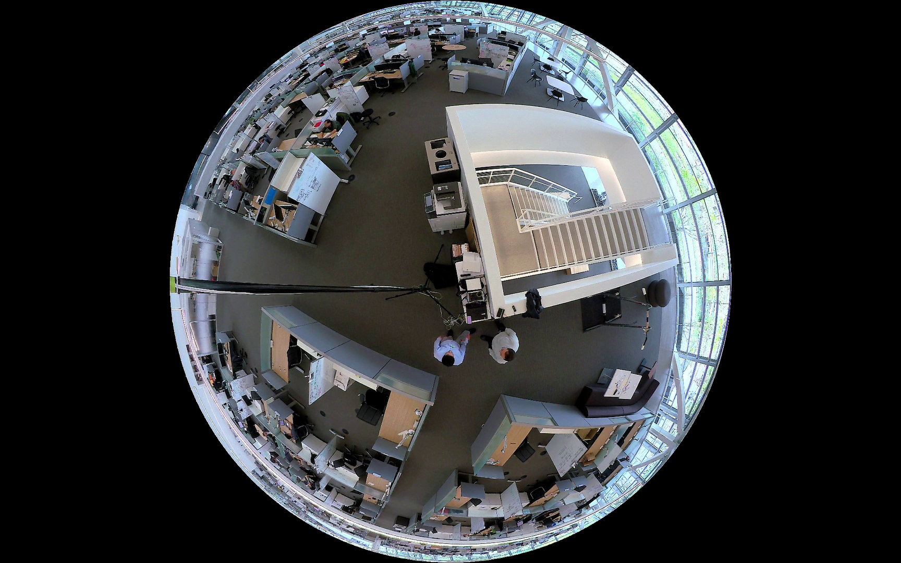
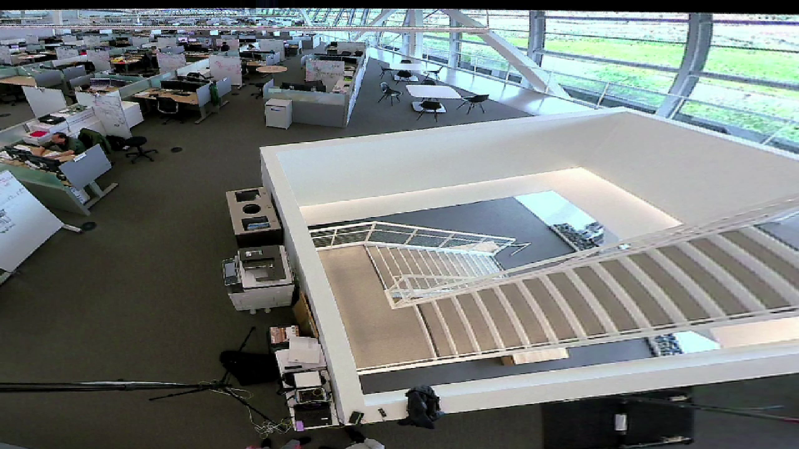

# How to dewarp video streams for your Azure DeepStream Accelerator solution
Many video streams contain distorted images.
For example, a security camera mounted on a ceiling may provide a 360-degree view,
but the perspective of objects close to the camera and those farther away can be very different.
Translating these 3D perspectives to a 2D screen often leads to a "warped" image.
Fortunately there are techniques that can be applied to render the video into images that are more easily understood by humans and AI models.
This article provides a short introduction to dewarping,
that you may find helpful in developing an AI-powered CV solution for your business scenario.

**A warped video image**



**A de-warped video image**


## Prerequisites
- Make sure you have completed all the prerequisites in the [Quickstart article](./quickstart-readme.md)
- Review the NVIDIA documentation for the [dewarper plugin](https://docs.nvidia.com/metropolis/deepstream/dev-guide/text/DS_plugin_gst-nvdewarper.html#features).
- The only additional requirement is that you have a video stream that will benefit from dewarping.


## Enable dewarping in DeepStream
Dewarping is a DeepStream pipeline configuration option that is turned on by setting the `dewarp:enable` parameter equal to True.
You'll see the next line must contain the location of the dewarping config file, which is required to provide additional parameters.
This file must be saved in the container directory.

```JSON
            "deepStream": {
                "enable": true,
                "pipelineConfigs": [
                    {
                        "id": "LicensePlateCascade",
                        "unsecureZipUrl": "",
                        "primaryModelConfigPath": "",
                        "secondaryModelConfigPaths": "",
                        "trackerConfigPath": "",
                        "deepstreamPassthrough": "",
                        "pipelineOptions": {
                            "dewarp": {
                                "enable": true,
                                "config_file": "config_examples/config_dewarper.txt"
                            },
                            "crop": {
                                "enable": true,
                                "x0": 480,
                                "x1": 1920,
                                "y0": 0,
                                "y1": 1080
                            },
```


## Dewarp configuration file
This is an example of a dewarping configuration file.

```ini
[property]
output-width=1920
output-height=1080

#########################################
# Note - Max 4 surfaces are supported
#########################################R
num-batch-buffers=1
[surface0]
# 1=PushBroom, 2=VertRadCyl
projection-type=2
surface-index=1
#dewarped surface parameters
width=1472
height=1384
top-angle=90
bottom-angle=-90
pitch=0
yaw=0
roll=0
focal-length=350
src-fov=180
```

Each of these fields is described by the
[NVIDIA documentation on the dewarping plugin](https://docs.nvidia.com/metropolis/deepstream/dev-guide/text/DS_plugin_gst-nvdewarper.html#features).


## Next steps
 - Create dewarping configuration file -- Use the resources provided here to create the configuration file and save it in the container directory
 - Update the deployment manifest -- Set the enable dewarping value to **true** and include the path to the dewarping configuration file
 - Optimize dewarping -- Set up a video stream and apply dewarping.
 Check your results.
 You will most likely have to tune the configuration parameters to get the best dewarped image(s).
 - Train your model -- A model making inferences on a dewarped stream should be trained using dewarped images.