# Tutorial: Bring your own model path (BYOM) to Azure DeepStream Accelerator

## Table of Contents

- [Introduction](#introduction)
- [Prerequisites](#prerequisites)
- [Summary](#summary)
- [Preparing your Model and Parser](#step-1-prepare-your-model-and-parser)
- [Concrete Example](#concrete-example-using-body-pose-2d-tao-model)

## Introduction

This article describes how to bring a custom model (and parser) to an Azure DeepStream Accelerator solution.

In this tutorial you'll learn how to use the included CLI tool to:
- Create a customer DeepStream Docker image
- Push the Docker image to Azure Container Registry

After the model container is uploaded to the cloud,
you will follow steps that are similar to those in previous paths to complete and verify the solution.


## Prerequisites
- Review the prerequisites section in the [Quickstart article](./quickstart-readme.md)

## Summary
This path consists of eight steps. Most of them are identical to the steps in the [Prebuilt model path](./tutorial-prebuiltmodel-path.md).

1. [Prepare your model and parser](#step-1-prepare-your-model-and-parser)
1. [Confirm the edge modules are running](./tutorial-prebuiltmodel-path.md#step-1-confirm-the-edge-modules-are-running)
1. [Identify your RTSP source](./tutorial-prebuiltmodel-path.md#step-2-identify-your-rtsp-source)
1. [Prepare and upload your container](./tutorial-prebuiltmodel-path.md#step-3-prepare-and-upload-your-container)
1. [Update the deployment manifest](./tutorial-prebuiltmodel-path.md#step-4-update-the-deployment-manifest)
1. [Deploy your updates to the edge device](./tutorial-prebuiltmodel-path.md#step-5-deploy-your-updates-to-the-edge-device)
1. [Modify regions of interest](./tutorial-prebuiltmodel-path.md#step-6-modify-the-regions-of-interest)
1. [Use the Player web app to verify results](./tutorial-prebuiltmodel-path.md#step-7-use-the-player-web-app-to-verify-your-results)

## Step 1. Prepare your model and parser
AI Models output a list of numbers - and if you are bringing your own custom model, we don't know how to interpret those numbers, so you
will need to bring a custom parser. This step will show you how to do that.

In pure DeepStream, Python parsing has limited support. If you want to bring a custom parser using the traditional DeepStream mechanism,
you may still do so by compiling a .so file and specifying the appropriate file and function in the configuration file. If this
is the route you wish to go with, please [see the appropriate documentation](https://docs.nvidia.com/metropolis/deepstream/dev-guide/text/DS_using_custom_model.html).
The remainder of this Step will focus on Python parsers.

To implement a Python parser, you need to bring a Python source file with code that adheres to a particular API so that we can stitch it into
the DeepStream Gstreamer pipeline and interpret the outputs.

### Custom parsers for primary models
A DeepStream pipeline in Azure DeepStream Accelerator consists of one or more models in a cascade; the first model is the so-called "primary"
model, and any that follow are called "secondary" models.

This section describes how to implement a custom parser for a *primary* model.

Depending on your needs, it is necessary to implement the following functions:
* `parse_det_model()`
* `parse_custom_model()`
* `add_custom_to_meta()`

Here is a template that you can use for implementing a custom primary parser:

```python
# import the packages you need
# if you need packages not available in the container by default, add them using the CLI tool

# mandatory
model_type   = 0 # 0-detection model, 1-custom model
name         = "MySSDParser"

# mandatory if model_type=0
labels       = ["none", "person"]

# mandatory if model_type=0
def parse_det_model(config, raw_outputs: dict):
    """
    This is used if the model is a *detection model*.

    Parameters
    ----------
    config.image_size : tuple
        Frame size, Ex.: (1920, 1080)
    raw_outputs   : dict
        Dictionary containing the model's outputs.
        Ex.: bboxes = raw_outputs["output:01"]
    Returns
    -------
    bboxes        : Nx4 numpy array
        Bounding boxes in the format (x,y,w,h)
    labels        : One dimensional numpy array of N integer numbers
        The labes id
    scores        : One dimensional numpy array of N float numbers
        The detection scores
    message       : Any json serializable
        A custom message, it can be None
    """

    # your code should determine 'bboxes', 'labels', 'scores' and 'message'

    return bboxes, labels, scores, message

# mandatory if model_type=1
def parse_custom_model(config, raw_outputs: dict):
    """
    This is used for all other types of models.

    Parameters
    ----------
    config.image_size : tuple
        Frame size, Ex.: (1920, 1080)
    raw_outputs   : dict
        Dictionary containing the model's outputs.
        Ex.: bboxes = raw_outputs["output:01"]
    Returns
    -------
    data        : Any
        If `data` is not None, it will be passed to the function
        add_custom_to_meta()
    message     : Any json serializable
        A custom message, it can be None
    """

    # your code should determine 'data' and 'message'
    return data, message

# optional if model_type=1
def add_custom_to_meta(self, data, batch_meta, frame_meta):
    """
    Parameters
    ----------
    data          : Any
        The first output from function `parse_custom_model()`
    batch_meta    : pyds.NvDsBatchMeta
    frame_meta    : pyds.NvDsFrameMeta
    """

    # modify the DS metadata based on the output of your custom model (`data`)
    pass
```

#### Example (ssd mobilenetv1):

```python
import numpy as np
import ssd_utils as UTILS

model_type=0
name="SSDMobilenetV1Parser"
labels=UTILS.get_labels()

def parse_det_model(config, raw_outputs: dict):
    try:
        num_detection_layer = raw_outputs["num_detections:0"]
        score_layer = raw_outputs["detection_scores:0"]
        class_layer = raw_outputs["detection_classes:0"]
        box_layer = raw_outputs["detection_boxes:0"]
    except:
        print("{}. Error: some layers missing in output tensors".format(name))
        return [], [], [], None

    num_detection = int(num_detection_layer[0])
    scores = score_layer[:num_detection]
    classes = class_layer[:num_detection].astype('int')
    boxes = box_layer[:num_detection, :].clip(0, 1)

    # apply NMS
    boxes, scores, classes = UTILS.nms(boxes, scores, classes, 0.2)
    w, h = config.image_size
    # convert frames to (x,y,w,h) format and scale them to frame size
    boxes = UTILS.to_xywh(boxes)*np.array([w, h, w, h])

    message="Number of objects detected: {}".format(len(scores))
    return bboxes, labels, scores, message
```
Note that when the function `parse_det_model()` is used (`model_type=0`), the metadata corresponding to the detection is added automatically.
If you want to have more personalized control of this you can use the `parse_custom_model()` and `add_custom_to_meta()` functions,
in which case you should set `model_type=1`.

```python
import numpy as np
import ssd_utils as UTILS

model_type=1
name="SSDMobilenetV1Parser"

def parse_custom_model(config, raw_outputs: dict):
    try:
        num_detection_layer = raw_outputs["num_detections:0"]
        score_layer = raw_outputs["detection_scores:0"]
        class_layer = raw_outputs["detection_classes:0"]
        box_layer = raw_outputs["detection_boxes:0"]
    except:
        print("{}. Error: some layers missing in output tensors".format(name))
        return [], [], [], None

    num_detection = int(num_detection_layer[0])
    scores = score_layer[:num_detection]
    classes = class_layer[:num_detection].astype('int')
    boxes = box_layer[:num_detection, :].clip(0, 1)

    # apply NMS
    boxes, scores, classes = UTILS.nms(boxes, scores, classes, 0.2)
    w, h = config.image_size
    # convert frames to (x,y,w,h) format and scale them to frame size
    boxes = UTILS.to_xywh(boxes)*np.array([w, h, w, h])

    message="Number of objects detected: {}".format(len(scores))
    return (bboxes, labels, scores), message

def add_custom_to_meta(self, data, batch_meta, frame_meta):
    bboxes, labels, scores = data
    # Modify the metadata according to your needs

```

## Custom parsers for secondary models

```python
# import the packages you need

# mandatory
gie_unique_id=3 # the same as `gie-unique-id` in the DeepStream config file.

# mandatory
def parse_sgie_model(config, raw_outputs):
    """
    Parameters
    ----------
    raw_outputs   : dict
        Dictionary containing the models outputs.
    Returns
    message       : Any json serializable
    -------
    """

    # get `message` from model output

    return message

```

#### Example (face landmarks).

Let's say you have a primary model for face detection and you want to detect the face ladmarks on the detected faces:

```python
import face_utils as UTILS

gie_unique_id=3
def parse_sgie_model(config, raw_outputs):
    try:
        landmarks = raw_outputs["landmarks"]
    except:
        print("LandmarksParser. Error: some layers missing in output tensors")
        return None

    d = UTILS.decode_landmarks(landmarks)

    message = {
        "LeftEye"   : [d.leye.x, d.leye.y],
        "RightEye"  : [d.reye.x, d.reye.y],
        "Nose"      : [d.nose.x, d.nose.y],
        "LeftMouth" : [d.lmouth.x, d.lmouth.y],
        "RightMouth": [d.rmouth.x, d.rmouth.y]
    }
    return message
```

Once you have implemented your custom parser, you should package up the model and parser file(s) into
a folder. Copy this folder into the `ds-ai-pipeline` folder.

Now that you have a folder with your custom assets, continue to [Step 1 of the Prebuilt model path](./tutorial-prebuiltmodel-path.md#step-1-confirm-the-edge-modules-are-running).
This should be the only difference between the paths.

## Concrete Example Using Body Pose 2D TAO Model

Let's take the previous steps and apply them to a concrete example. We will use the BodyPose2D model from the NVIDIA model zoo
for this example. Technically, we already support this model as a pre-supported model ([see the concrete example for pre-supported models](./tutorial-prebuiltmodel-path.md#concrete-example-using-body-pose-2d-tao-model)),
but we will reuse it here to show how you could bring a custom parser.

1. [Download the BodyPose 2D model](https://catalog.ngc.nvidia.com/orgs/nvidia/teams/tao/models/bodyposenet/files?version=deployable_v1.0.1)
1. Prepare a folder whose contents look like this:

    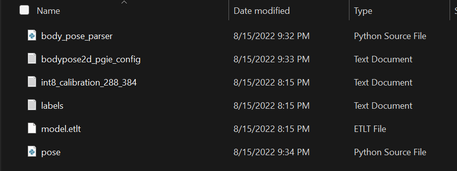

    Where:

    - labels.txt: Comes from the zip file you downloaded
    - model.etlt: Comes from the zip file you downloaded
    - int8_calibration_288_384.txt: Comes from the zip file you downloaded
    - body_pose_parser.py: A Python file that contains the code you need for parsing the model's output
    - pose.py: A Python file that contains additional source code that your parser makes use of
    - bodypose2d_pgie_config: The primary model configuration file for DeepStream's [nvinfer](https://docs.nvidia.com/metropolis/deepstream/dev-guide/text/DS_plugin_gst-nvinfer.html) or [nvinferserver](https://docs.nvidia.com/metropolis/deepstream/dev-guide/text/DS_plugin_gst-nvinferserver.html).

    The Python files and the primary model configuration file (bodypose2d_pgie_config) [can be found here](../ds-ai-pipeline/src/ai-pipeline-tests/byom-test/custom-parser-test-case/pose).

    It is outside the scope of this tutorial to go into the details of the bodypose2d_pgie_config.txt file, as it is just a DeepStream NVInfer configuration
    file, and a working knowledge of DeepStream is assumed. If you have questions about that file, please refer to the
    [appropriate documentation](https://docs.nvidia.com/metropolis/deepstream/dev-guide/text/DS_plugin_gst-nvinfer.html).

At this point, you can either zip this up and upload the zip file to Blob Storage and then download it to the container,
or you can build the folder into a custom version of the container. We will walk through both options below.

### Upload Zip File

If you choose to upload the zip file instead of building it into the container, follow these steps:

1. Make sure you have an Azure subscription with an Azure Storage Account attached. You should already have this from the quickstart.
1. Create a blob storage container that has anonymous access (see the screenshot below). In your Storage Account in the Azure Portal,
first click on "Containers", then "+ Container", then choose "Container" level access.

    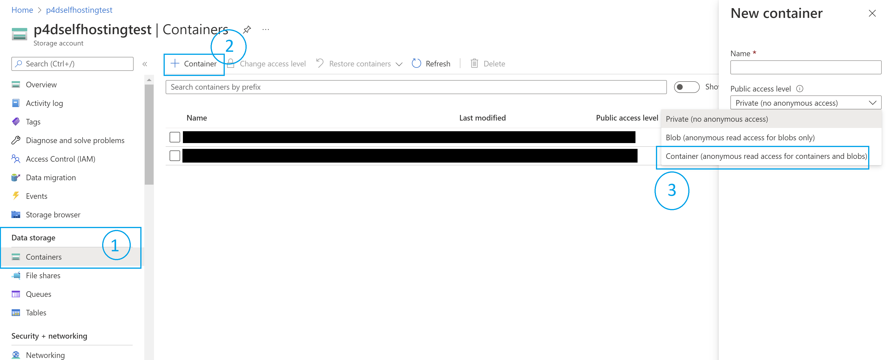

1. Zip the folder's contents (make sure not to have a subfolder - just the raw files inside the zip file).
1. Upload your .zip file to blob storage (from the Azure Portal, go to your Storage Account, then "Containers", select a container, then "upload").
1. Modify the deployment manifest template file to point to your zip file:

    ```JSON
                  "unsecureZipUrl": "<YOUR ZIP URL>",
    ```
1. Update the deployment manifest template to tell the ai-pipeline where the model configuration file is:

    ```JSON
                    "primaryModelConfigPath": {
                        "configFile": "bodypose2d_pgie_config.txt",
                        "pyFile": "body_pose_parser.py"
                    },
    ```

1. [Skip the next section](#common-steps)

### Build using CLI Tool

If you choose to rebuild the ai-pipeline container to include your model and parser, follow these steps:

1. Make sure you have somewhere to put the container we are about to build. We (obviously) recommend an Azure Container Registry.
1. Update your deployment manifest .env file with your credentials:

    ```txt
    CONTAINER_REGISTRY_NAME=whatever.azurecr.io
    CONTAINER_REGISTRY_PASSWORD=<YOUR REGISTRY PASSWORD>
    CONTAINER_REGISTRY_USERNAME=<YOUR REGISTRY USERNAME>
    ```

    If you are using an ACR (Azure Container Registry), you can enable an Admin user ("Access Keys" -> "Admin User"), then
    copy the login server, username, and password (see the screenshot below).

    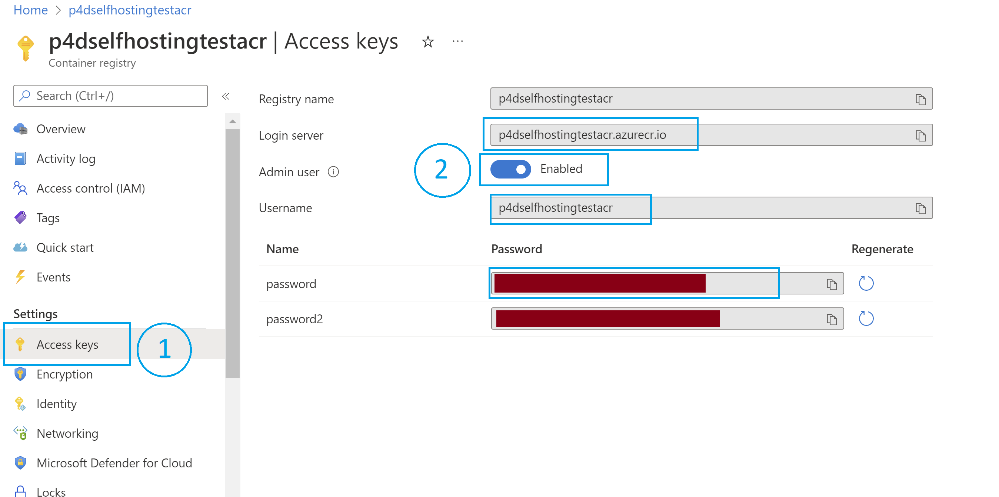

1. Create a folder called `custom-assets` in the `ds-ai-pieline` folder and put the contents of your custom asset folder
in there.
1. Rebuild the container. In this case, we do not need Triton Inference Server ([see here for how to decide](./how-to-usecommandlinetool.md#model-compatability-matrix)),
so we will build using nvinfer and use the nvinfer configuration file syntax for the pgie txt file.
    - If you are building for ARM: `azdacli create --device-type Jetson --tag azda-byom-example --add "./custom-assets /custom-assets" --build-dir <path to the docker-build directory>`
    - If you are building for x86: `azdacli create --device-type dGPU --tag azda-byom-example --add "./custom-assets /custom-assets" --build-dir <path to the docker-build directory>`
    - Please note that regardless of where you are relative to the custom-assets folder, you will use `--add "./custom-assets /custom-assets"`. This is because the path specified is relative to the docker-build
    directory.
1. Either use Docker directly (`docker tag azda-byom-example <your-ACR>/<your-registry-name>:<your-tag>`) or use the CLI tool:
`azdacli push --image-name azda-byom-example --container-registry <your container registry> --username <your username>`, then type in your password when prompted.
1. Change the .env file to update the following item:

    ```txt
    DS_AI_PIPELINE_IMAGE_URI=<The tag you pushed>
    ```
1. Update the deployment manifest template to tell the ai-pipeline where the model configuration file is:

    ```JSON
                    "primaryModelConfigPath": {
                        "configFile": "/custom-assets/bodypose2d_pgie_config.txt",
                        "pyFile": "/custom-assets/body_pose_parser.py"
                    },
    ```

## Example Using Microsoft Custom Vision AI Model
This example will guide how to bring your own model generated by Custom Vision website to Azure DeepStream Accelerator

## Prerequisite
1. The video is going to be inferenced
2. A blog storage. Learn how to create a blog storage [here](https://docs.microsoft.com/en-us/azure/storage/common/storage-account-create?tabs=azure-portal)

## Content
| File             | Description                                                   |
|-------------------------|---------------------------------------------------------------|
| `amd64/config_infer_custom_vision.txt`    | The config file for ai-pipeline module for x86 |
| `amd64/libnvdsinfer_custom_impl_Yolo_dp61_amd.so`    | The parser library for x86 |
| `arm64/config_infer_custom_vision.txt`    | The config file for ai-pipeline module for Jetson Devices|
| `arm64/libnvdsinfer_custom_impl_Yolo_dp61_arm.so`    | The parser library for Jetson Devices |

## Steps
1. Create an object detection model as in [here](https://docs.microsoft.com/en-us/azure/cognitive-services/custom-vision-service/get-started-build-detector). Only iterations trained with a compact domain can be exported

2. Export your model with ONNX platform
   1. Switch to the `Performance` tab
   2. Select the `Export` button that appears
      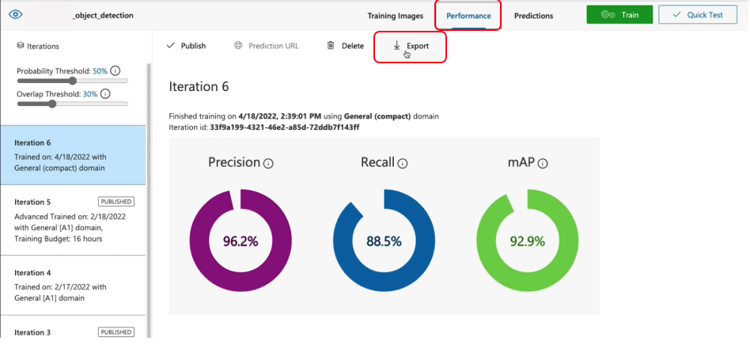
   3. Select `ONNX`, and then `Export`
      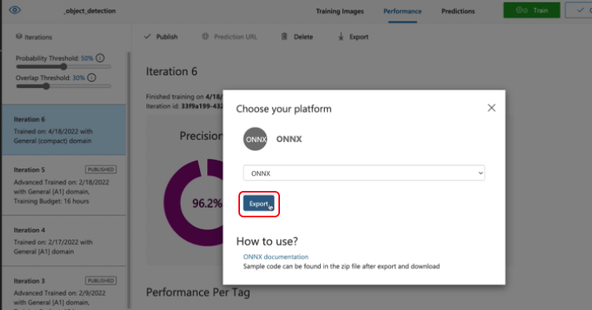
   4. Once the file is ready, select the `Download` button.
   5. Open the downloaded .zip file and extract the `model.onnx`, `label.txt` file from it. This file contains your object detection model.

      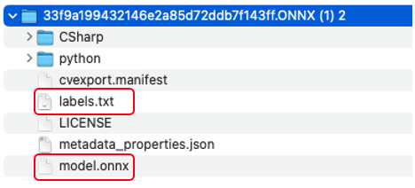

3. Prepare your MyCustomThings.zip
   1. For `AMD64` machine
      1. Download the config_file `config_infer_custom_vision.txt` and parser library `libnvdsinfer_custom_impl_Yolo_dp61_amd.so` of the custom vision project [here](../parser-examples/cv_parsers/amd64)

   2. For `ARM64` machine
      1. Download the config_file `config_infer_custom_vision.txt` and parser library `libnvdsinfer_custom_impl_Yolo_dp_61_arm.so` of the custom vision project [here](../parser-examples/cv_parsers/arm64)

   3. Config the `config_infer_custom_vision.txt`
      1. Modify that the `num-detected-classes` property maps to the number of classes or objects that you've trained your custom vision model for.

   4. Create a `MyCustomThings` folder and add the files including `model.onnx`, `label.txt`, `config_infer_custom_vision.txt`, `parser library` (ex:libnvdsinfer_custom_impl_Yolo_dp61_arm.so) or into it

   5. Zip MyCustomThings folder with the following structure
      ```
      MyCustomThings/
         |
            - model.onnx
            - label.txt
            - config_infer_custom_vision.txt
            - libnvdsinfer_custom_impl_Yolo_dp61_arm.so
      ```
   [!Note] For Mac users, please open your terminal and zip your folder by following commands to remove the hidden file
      ```
         zip -d MyCustomThings.zip "__MACOSX*"
      ```

4. Upload MyCustomThings.zip and video to your blog storage and note down the url for futher use.
   1. Visit your Azure blob storage resource
   2. Select `Containers` under Data Storage, and select `+ Container`
   3. Fill in your container name, and select `Blob (anonymous read access for blobs only)`
   4. Click `Create`
      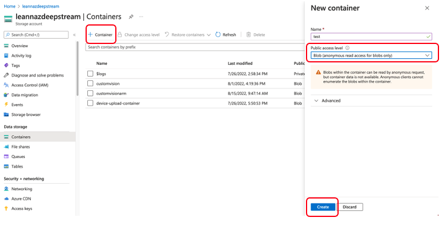
   5. Click the container you just created
   6. Select `Upload` to select your model zip file. Click `Upload`
      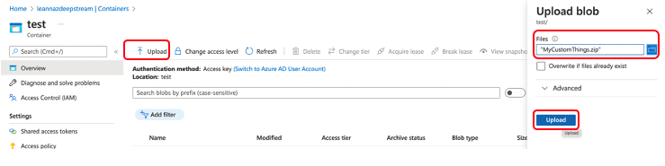
   7. Repeat the same process from iii to vi to upload your video file if needed
   8. Note down the blob urls for further use
      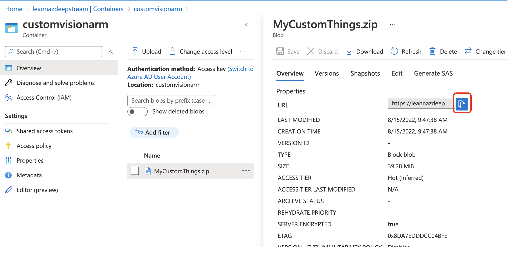


5. Deploy the corresponding deployment manifest to your devices

6. Place your video to be inferenced to the place you config in the deployment manifest
   1. Open your terminal and ssh to your device
   2. Enter into the ai-pipeline container
      ```
      docker exec -it ai-pipeline bash
      ```
   3. Change directory to the folder to save the videos
      ```
      cd /opt/nvidia/deepstream/deepstream/samples/streams/
      ```
   4. Download the video you uploaded in the blob storage
      ```
      wget <The blob url of your video>
      ```
7. Config your Module Identity Twin of your `BusinessLogicModule` module
   1. Visit your Azure IoT Hub and click your device id
   2. Click `BusinessLogicModule`
   3. Click `Module Identity Twin`
   4. Add the value below under the key `startRecording`
   ```
   ,
   {
      "configId": "PeopleDetection",
      "state": true
   }
   ```
   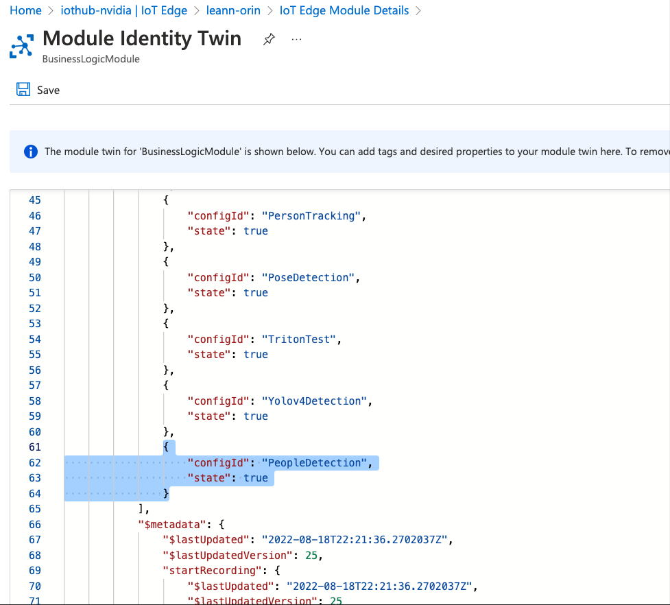
   1. Click Save


8. Configure the Module Twin of the `controllermodule`
   1. Visit your Azure IoT Hub and click your device id
   2. Click `controllermodule`
   3. Click `Module Identity Twin`
   4. Change the value of the `subtype` to `FILE`
   5. Update the value of the `endpoint` below
      ```
      "endpoint": "file:///opt/nvidia/deepstream/deepstream/samples/streams/XXXXX.mp4",
      ```

      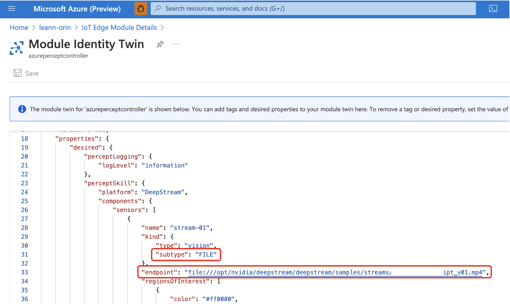

   6. Update the value of the `unsecureZipUrl`
      ```
      "unsecureZipUrl": "https://xxxxxxxxx.blob.core.windows.net/xxxxxxx/MyCustomThings.zip",
      ```

   7. Update the value of the `primaryModelConfigPath`
      ```
      "primaryModelConfigPath": "config_infer_custom_vision.txt",
      ```
      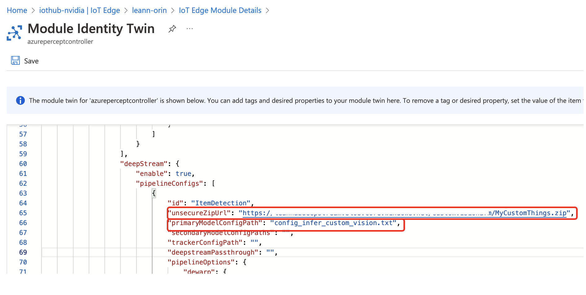
   8. Click Save

After completed the above seven steps, you should able to see the inference video in the blob storage you config in [here.](./quickstart-readme.md#setup-the-edge-device)


### Common Steps

Regardless of whether you uploaded your model using a .zip file or built your container around your model,
follow these steps:

1. Rebuild your business logic container:
    - Modify [the source code](../business-logic-container/main.py) to do whatever you want. See [modifying the business logic container](./how-to-modifybusinesslogic.md)
    for detailed instructions.
    - [Build the new container](./how-to-modifybusinesslogic.md#building-the-blc)
    - [Push the new container](./how-to-modifybusinesslogic.md#deploying-the-blc) to an ACR.
    - Update your .env file's `BUSINESS_LOGIC_IMAGE_URI` with the new image.
1. Regenerate your deployment manifest from the deployment manifest template (in VS Code, right click the template
and select "Generate IoT Edge Deployment Manifest").
1. Update your deployment (in VS Code, right click the generated deployment manifest and select "Create Deployment for Single Device").
