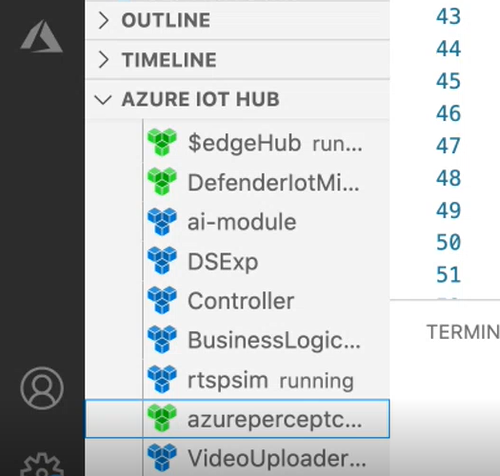
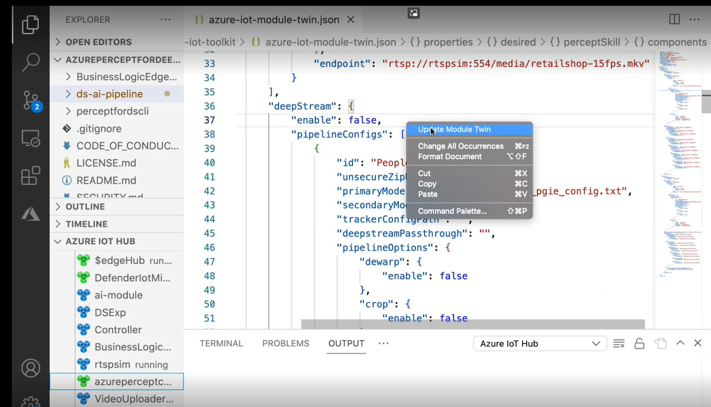

# Tutorial: Azure DeepStream Accelerator - Getting started path

In this tutorial you’ll learn how to deploy an example use case to get yourself familiar with Azure DeepStream Accelerator. Using pre-trained models and pre-recorded videos of a simulated manufacturing environment, you’ll perform the steps required to create an Edge AI solution. You’ll learn how to identify product defects, prepare and deploy your computer vision (CV) model to your Edge device, and verify the results using the included web app.

This tutorial guides you through five major steps to create your Edge AI solution using Azure DeepStream Accelerator:

- [Step 1. Confirm your Edge modules are running](#step-1-confirm-your-edge-modules-are-running)
- [Step 2. Upload the model](#step-2-upload-the-model)
- [Step 3. Update the deployment manifest file](#step-3-update-the-deployment-manifest-file)
- [Step 4. Deploy your updates to the Edge device](#step-4-deploy-your-updates-to-the-edge-device)
- [Step 5. Verify your results](#step-5-verify-your-results)

## Prerequisites

Before beginning this tutorial, make sure you have completed all the prerequisites in [Prerequisite checklist for Azure DeepStream Accelerator.](./quickstart-readme.md)


## Step 1. Confirm your Edge modules are running

Use Visual Studio (VS) Code to confirm the modules you deployed in the [Prerequisite checklist for Azure DeepStream Accelerator](./quickstart-readme.md) section are running. You can do this by checking the module status in the Azure IoT Hub section of the left navigation in VS Code.



## Step 2. Upload the model

This tutorial includes a pre-trained MaskRCNN model and parser.

- For information about pre-trained models, visit [pre-trained model](../get-started-demo/workspace/models/maskrcnn/). Then download the **manufacturing.zip** file.
- To familiarize yourself with the MaskRCNN model, visit [Mask R-CNN model](https://docs.nvidia.com/tao/tao-toolkit/text/instance_segmentation/mask_rcnn.html).
- For information on how the model was trained using transfer learning, follow the steps in this [Jupyter Notebook](../get-started-demo/Manufacturing%20Use%20Case%20Hands%20On%20Lab.ipynb).

We recommend you upload the pre-trained model to a publicly accessible web server. You can do this using the **Azure Storage Account** you created in [Prerequisite checklist for Azure DeepStream Accelerator](./quickstart-readme.md).

- To find the containers you downloaded, open the [Azure portal](https://ms.portal.azure.com/) and go to your **Azure Storage**. Then, on the left navigation, select **Containers**.
- Create a new **Blob Storage Account** with **Container** access so you can upload models that are available for public access. Save the path for this storage account as you’ll need it in the next step.


## Step 3. Update the deployment manifest file

In this step you’ll learn how to update the deployment manifest file. First you’ll download the [template file](../ds-ai-pipeline/x86_64/deployment.default.template.json) and then you’ll modify the values in the file for an x86 device.

You can also modify the template for an ARM device by downloading the appropriate file and using the same steps below.


1. Visit the [template file](../ds-ai-pipeline/x86_64/deployment.default.template.json) location in your local clone of the repository.
2. Update the Controller section of the manifest template file. To do this, update the ```unsecureZipUrl``` value to point to the URL of the model you uploaded in the previous step.

   For this tutorial, we’ve created  a zip file you can use, but if you want to understand how the zip file is structured, visit [Zip File Structure](./how-to-configcontroller.md#zip-file-structure).

3. Update the ```primaryModelConfigPath``` to the following value: ```pgie_config.txt```.

        ```JSON
                "pipelineConfigs": [
                    {
                    "id": "PeopleDetection", <--- Feel free to change this value to something more like 'ManufacturingDefectDetection' if you'd like, but if you do, please also change it in the 'streams' section of your JSON.
                    "unsecureZipUrl": "", <------- HERE
                    "primaryModelConfigPath": "pgie_config.txt", <----- CHANGE TO THIS VALUE
                    "secondaryModelConfigPaths": "",
                    "trackerConfigPath": "",
                    "deepstreamPassthrough": "",
                    "pipelineOptions": {
                        "dewarp": {
                        "enable": false
                        },
                        "crop": {
                        "enable": false
                        },
                        "osd": {
                        "enable": true
                        }
                    }
                    }
                ]
        ```

4. Also in the Azure Controller section of the manifest template file, change the ```endpoint``` sensor URI to ```rtsp://rtspsim:554/media/sample-input-1.mkv```, as shown in the following code sample.

        ```JSON
            "azdaConfiguration": {
            "platform": "DeepStream",
            "components": {
                "sensors": [
                {
                    "name": "stream-01",
                    "kind": {
                    "type": "vision",
                    "subtype": "RTSP"
                    },
                    "endpoint": "rtsp://rtspsim:554/media/sample-input-1.mkv", <----- CHANGE TO THIS
        ```


5. To see inference bounding boxes on the video stream output, enable on-screen display (OSD) by updating ```pipelineConfigs```, then ```osd``` and set the enable value to ```true```.

7. Save your manifest template file changes.

9. To generate your deployment manifest, right-click on the template in VS Code and select **Generate IoT Edge deployment manifest**.


## Step 4. Deploy your updates to the edge device

In this step, you’ll use the module twin feature of Azure IoT Edge to update the Edge device with the pre-trained module and sample video.

- For more information about module twins, visit [Understand and use module twins in IoT Hub](https://docs.microsoft.com/en-us/azure/iot-hub/iot-hub-devguide-module-twins).
- For more information about deploying edge modules, visit [Deploy Azure IoT Edge modules from Visual Studio Code](./media/update-module-twin.png).


### Update the Edge device with these changes

1. Open the deployment manifest JSON in VS Code.
2. Right-click the window and select **Update Module Twin**.

   

#### Alternatively, you can deploy the solution by:

- Right-clicking on the deployment manifest JSON (not the template) and selecting **Create deployment for single device**.

When you’ve updated the Edge device with the model package, the simulated video runs automatically, and the model will begin making inferences.

More specifically, the system will go through these steps:

1. The AI-Pipeline module will download the zip file from the URL that is specified.
1. The AI-Pipeline module will extract the zip file's contents and verify that it can find the model configuration file.
1. The AI-Pipeline module will construct a DeepStream pipeline on the fly by choosing and configuring a few DeepStream/Gstreamer plugins based on the model configuration and the Controller module's twin.
1. This DeepStream pipeline will attempt to:
  1. Connect to all specified sources.
  1. Deserialize the AI model, then reserialize it into whatever format (in this case, TRT).
  1. Load the serialized AI model into the GPU.
  1. Run the pipeline.

Please note that DeepStream (and Gstreamer) is quite verbose with its logs and warnings. It is perfectly normal for it to attempt several model (de)serialization approaches before it settles on one that works.

## Step 5. Verify your results

Using one of the below approaches, you should be able to view the results, which should look something like this:


### Install the Player Web App

The Player Webb App is a web app that allows you to play recorded videos and define ROIs for the different video streams deployed as part of this solution. It communicates the ROI locations to the Business Logic module so that the module can determine if detected objects appear within an ROI. This web app does not enable you to view "live-stream" videos from your Edge device.

- To install the video player, follow the instructions in the [How to use the Player web app](./how-to-usewebappwidget.md).

### Verify your Device is working correctly

1. Use the Player web app to navigate to the **Blob Storage Account** that you created earlier in this tutorial to host your videos.
2. Confirm that your videos are being uploaded there.

### Alternative: Use VLC to view your stream

Azure DeepStream Accelerator by default streams a view of your results onto "rtsp://localhost:8554/<your-pipeline-id>". You can see the exact URI in the AI Pipeline's logs.
For security purposes, this is a little trickier to view, but it can be done.

Specifically, you need to:

1. Expose the stream from the Docker container to your device's host OS.
1. Expose the stream from the device's host OS to whatever network or device you want to view the stream on.

#### Expose the stream from Docker

**Note** This part should already be done by default in our deployment manifest templates.
So this section serves to explain this a bit.
If you'd like, you can remove this port binding, as it is a security best practice to remove
bindings that you do not use.

- Ensure this snippet is present in your deployment manifest *template* inside the 'createOptions' for ai-pipeline (note that it should be there ):

```json
                "ExposedPorts": {
                  "8554/tcp": {}
                },
```

- and add this snippet inside "HostConfig" of the same section:

```json
                  "PortBindings": {
                    "8554/tcp": [
                      {
                        "HostPort": "8554"
                      }
                    ]
                  },
```

Now regenerate your deployment manifest and redeploy (if these sections weren't already there).

Congratulations! You have successfully created and deployed an Edge AI solution using Azure DeepStream Accelerator Getting Started Path.

#### Expose the stream from the device's host OS

This part is a little more cumbersome. There are many ways to do this, depending on your end goal. If your device has a monitor
and keyboard plugged in, then you can simply open up VLC on the device and view the results by going to your stream's endpoint,
provided your device has the CPU/GPU bandwidth to handle that in addition to the running pipeline.

But if your device is headless, then you can try port forwarding. The following instructions will create an SSH tunnel between
your device and your computer and we will forward the traffic from port 8554 to your computer through that SSH tunnel,
thereby enabling encryption and authentication (by making use of the SSH protocol).

1. First, make sure that your device allows port forwarding. Edit /etc/ssh/sshd_config (if present) to make sure
   "AllowTcpForwarding" is "yes". Then restart your device.
1. Open a Powershell session (Windows) or a terminal session (Linux/Mac). This will be the SSH tunnel.
1. Type `ssh -L 8554:localhost:8554 <ssh-user>@<ssh-address>` This should open an SSH tunnel with port forwarding to/from your device.
1. Make sure that SSH session stays open while opening VLC and entering `rtsp://localhost:8554/<your-pipeline-id>` into the stream endpoint.
   Careful! The stream endpoint URI in VLC is case-sensitive, but there is a bug where the endpoint is mapped in a case-*insensitive* way
   to a previously used endpoint if one matches. So if you enter the ID with the wrong case, then you will not be able to access your actual
   endpoint.

## Clean up resources

If you're not going to continue to use your Azure resources, you may choose to delete them. For more information, visit [Azure Resource Manager resource group and resource deletion](https://docs.microsoft.com/en-us/azure/azure-resource-manager/management/delete-resource-group?tabs=azure-portal).

> [!NOTE]
> When you delete a resource group:<br>- All the resources in that group are deleted.<br>- It’s irreversible.<br><br>If you want to save some of the resources, delete the unwanted resources individually.

## Next steps

Now that you have completed the Azure DeepStream Accelerator Getting Started Path tutorial, we recommend the following tutorials:

- [Tutorial: Azure DeepStream Accelerator - Pre-built model path](./tutorial-prebuiltmodel-path.md)  to build and deploy a CV solution using one of several popular pre-supported models and your own video stream.
- [Tutorial: Azure DeepStream Accelerator - Bring your own model path (BYOM) model path](./tutorial-byom-path.md) to build and deploy a CV solution using your own custom model and parser.

If you encounter issues when you are creating an Edge AI solution using Azure DeepStream Accelerator, visit:

- [Troubleshoot: Azure DeepStream Accelerator - Known issues](./documentation/troubleshooting.md)
