# Labeling Defects with Azure Machine Learning

## Prerequisites

In order to follow these steps, you will need the following: 
- An [Azure Machine Learning](https://docs.microsoft.com/en-us/azure/machine-learning/) workspace 
- Raw images to be uploaded for labeling

## Step 1: Create an Instance Segmentation Labeling Project
First you will need to click, `Create` on the Data Labeling service within Azure Machine Learning Studio.
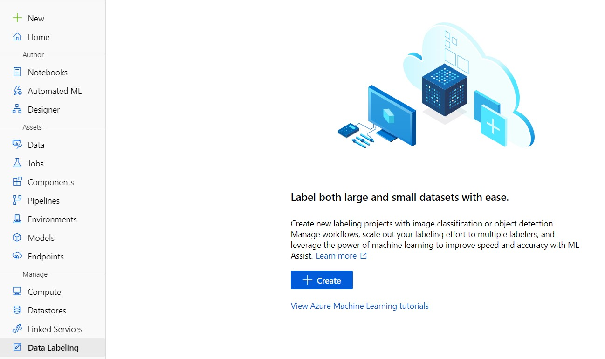

This will take you to a page that looks like the below.
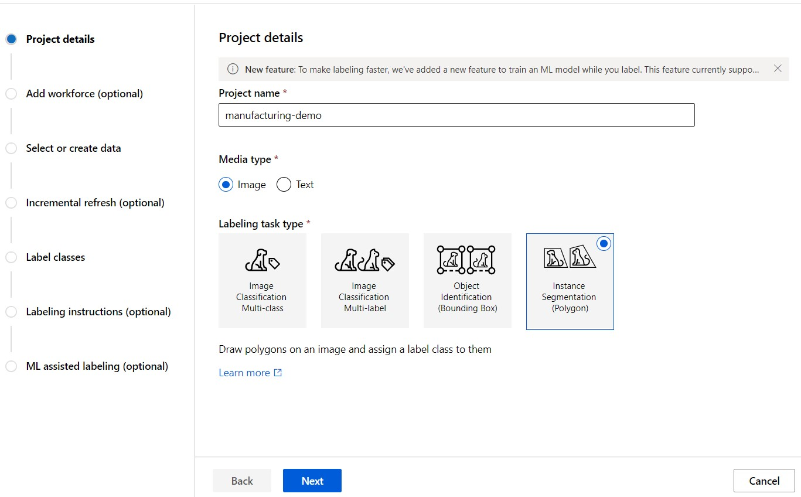

### Project details
- On the project Details pane, give your project a name. We called ours `manufacturing-demo`
- Click `Next`
    
### Add workforce (optional)
- Just click `Next` here as we will be labeling images ourselves

### Select or create data
- This next series of steps focuses on setting up the dataset to be labeled. 

#### Basic info
- On the project Details pane, give your project a name
- Click on the `+ Create` icon to create a new dataset.
    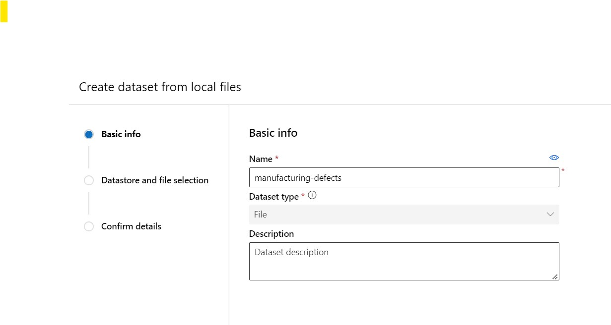

#### Datastore and file selection
- Give your dataset a name and click Next
- On the Datastore and file selection page, select the datastore you would like to use (you can create a new datastore if needed).
- Choose `Browse` and navigate to the images you would like to upload for labeling
- Click `Next`
    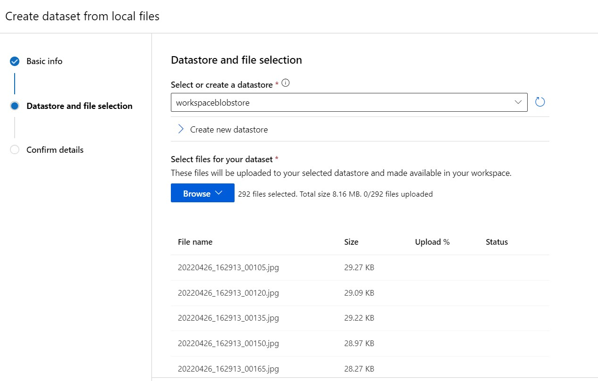

#### Confirm details
- Validate all of the information appears as expected
- Click `Create`

Now you can select your dataset and click `Next`

### Incremental refresh (optional)
We will not be using incremental refresh for this lab, so you can simly click `Next`

### Label classes
Enter two class names here: "pass", and "defect"
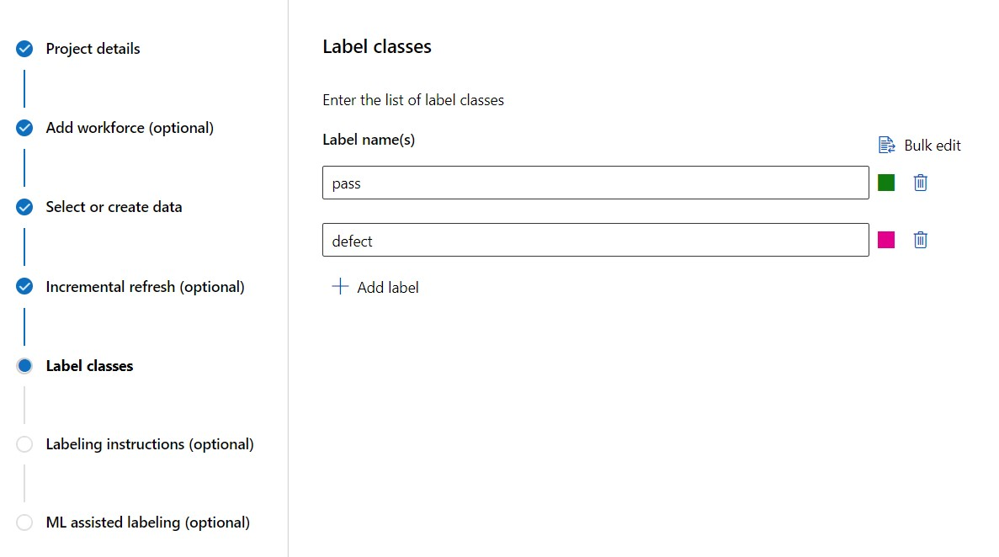

### Labeling instructions (optional)
- This is where you can provide additional details for the team that will be labeling your dataset. We assume the user will self-label the data so we will leave this blank and click `Next`.

## ML assisted labeling (optional)
- We will be labeling the data ourselves for this lab exercise, so you can click `Next`
- Finally, you can click `Create Project` to finish the project setup.

## Step 2: Label dataset using Azure ML
Now we are ready to label some images. Begin by clicking `Label data` at the top of your project dashboard. This will take you to the labeling experience.

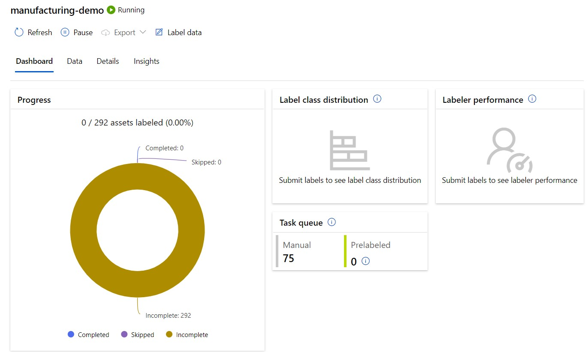

Next, you can use your mouse to create a polygon region for the boxes. Add enough points that you capture the outline of each box in the field of view. Each box should be labeled as pass or defect.

Below we illustrate what the output looks like for two example images. This labeling process continues until enough images have been labeled to train a model. We labeled all 292 images and made them available for the purposes of the lab exercise. If you'd like to use our labels, you can skip to the `Manufacturing Use Case Hands On Lab.ipynb` jupyter notebook.

### Example with passing boxes

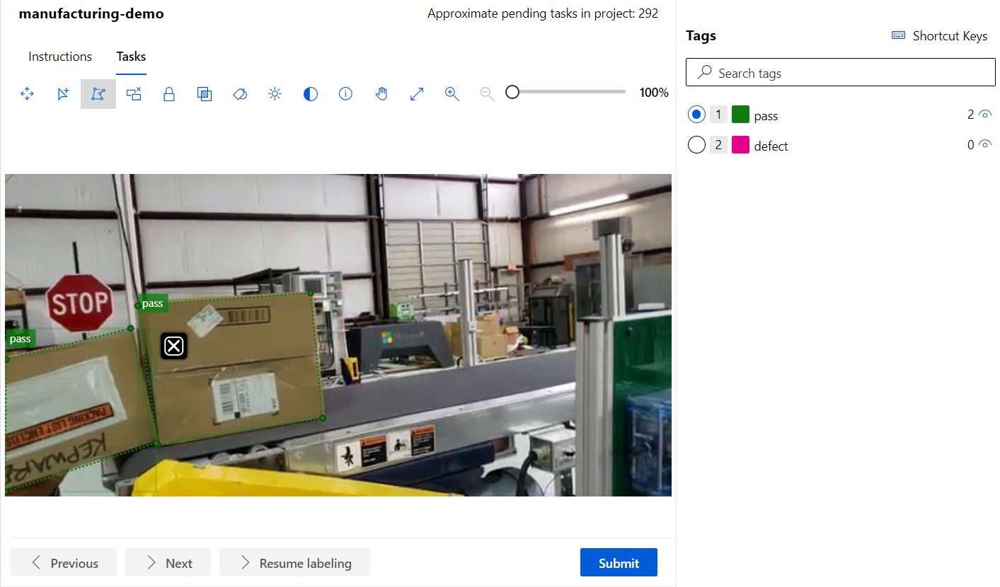

### Example with defects and passing boxes

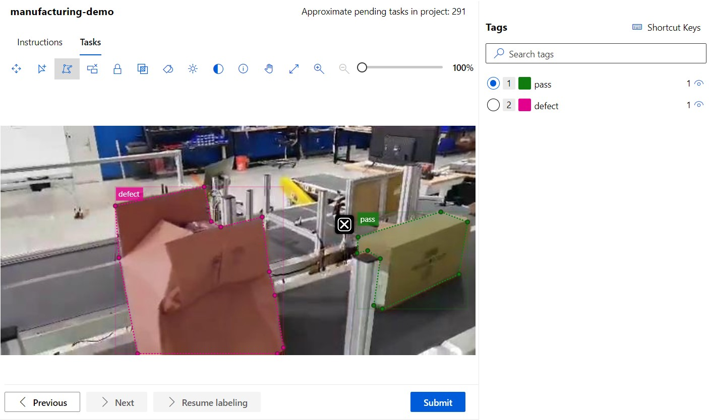

## Step 3: Review Labels
At this point, you can see the progress on your labeling project. You can continue to label images and periodically export the labels to test in your modeling approach. This view also shows the productivity breakdown of individual labelers on the team if you have a larger corpus of images you are labeling.

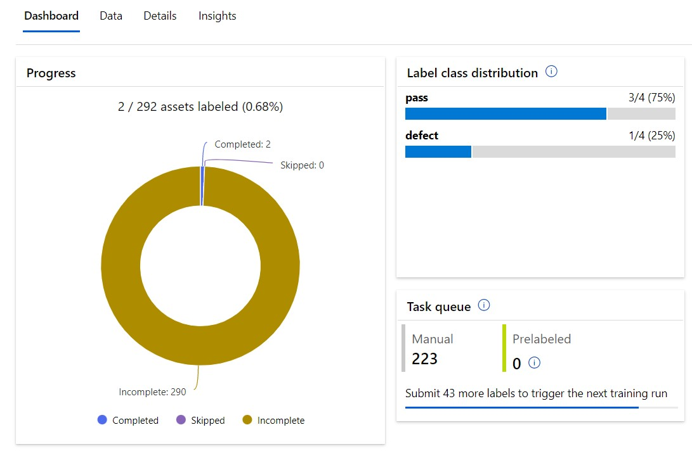

## Step 4: Export Labels
In this step, you will export the COCO annotations from the Azure ML labeling service.

- At the top of your labeling project dashboard, click `Export`
    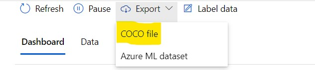    
- Select `COCO File`
- Select the range of files to export. We recommend keeping the default settings
- Click `Submit`
- The Azure ML labeling service will begin to generate your COCO annotations JSON file
- Once your file is ready, you will receive a notification with a download link. Download this file and save it to the `workspace/data/annotations.json` file path.    
    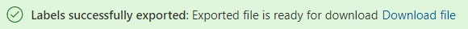

## Complete!
You are now ready to proceed with the `Manufacturing Use Case Hands On Lab.ipynb`

